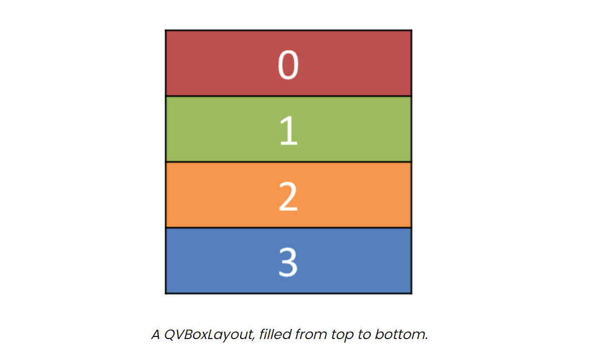
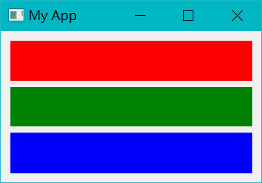
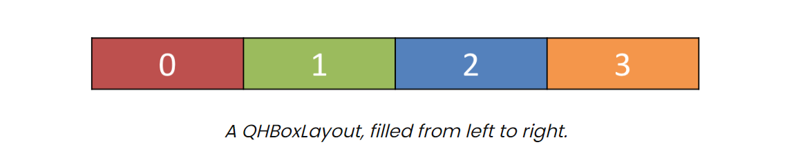
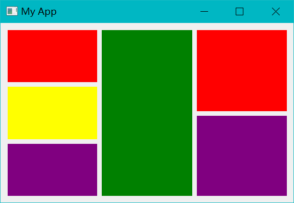
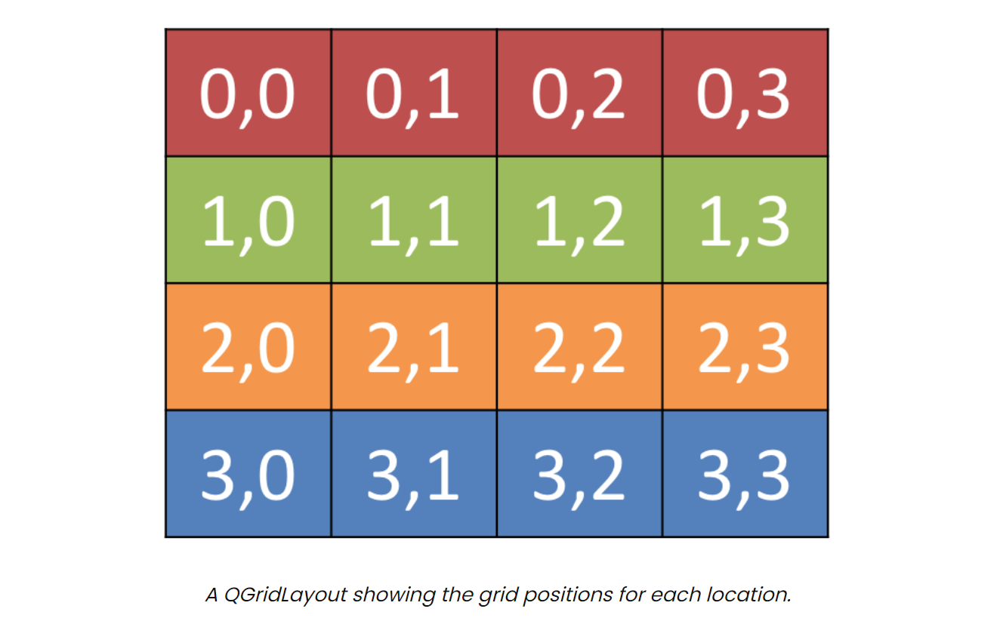
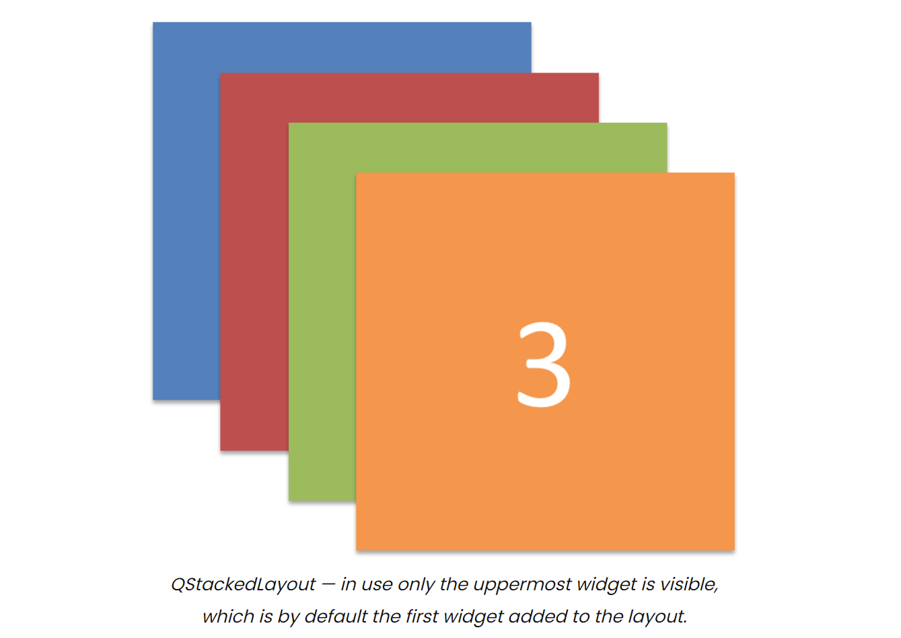
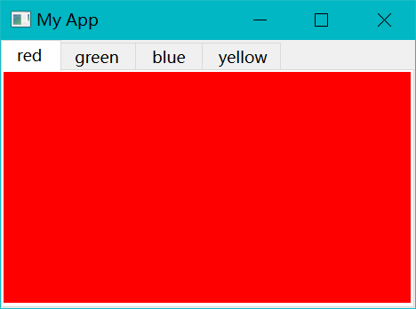

<h1 align = 'center'> Layouts </h1>

| Layout         |   Behavior   |
| :------------- | :----------: |
| QHBoxLayout    | 线性水平布局 |
| QVBoxLayout    | 线性垂直布局 |
| QGridLayout    | 网格分割布局 |
| QStackedLayout |   堆叠布局   |

    class Color(QWidget):

        def __init__(self, color):  # color: str
            super(Color, self).__init__()
            self.setAutoFillBackground(True)  # 用背景颜色自动填充窗口

            palette = self.palette()  # 设置默认的全局调色板
            palette.setColor(QPalette.ColorRole.Window, QColor(color))  # 更改当前调色板颜色为新的颜色
            self.setPalette(palette)  # 应用调色板，让每一个不同的部件填充我们设定的颜色

要将布局添加到窗口中，我们需要一个虚拟的QWidget来保存布局。

## QVBoxLayout  vertically arranged widgets

在 QVBoxLayout 中，部件是竖向线性排列的，添加部件会从底部插入。  
  

添加布局前，我们需要把他应用在一个虚拟部件，然后使用.setCentralWidet。  
我们设置的颜色部件会在布局中自动排列。

        layout = QVBoxLayout()  # 创建实例

        # layout.addWidget(Color('red'))
        # layout.addWidget(Color('green'))
        layout.addWidget(Color('blue'))  # 给布局添加背景颜色

        widget = QWidget()  # 创建虚拟部件
        widget.setLayout(layout)  # 将部件与部件结合起来
        self.setCentralWidget(widget)

当同时添加多个颜色时，这些颜色会竖直排列。

颜色的边框没有颜色，边框是通过其他布局元素控制的。

## QHBoxLayout  horizontally arranged widgets

新加入部件时从右部加入

代码与上一个几乎类似，将QVBoxLayout change to QHBoxLayout

## Nesting layouts

    layout1 = QHBoxLayout() # 主视图
    layout2 = QVBoxLayout() # 左视图
    layout3 = QVBoxLayout() # 右视图

    '''

    layout1.addLayout( layout2 )
    layout1.addWidget(Color('green'))
    '''
    layout1.addLayout( layout3 )

嵌套定义布局

设置不同部件之间的边距：

    layout1.setContentsMargins(0, 0, 0, 0)  # 单个部件的(左, 上, 右, 下)边距
    layout1.setSpacing(10)  # 每个部件与其他部件的距离

## QGridLayout  widgets arranged in a grid

用网格分开的多个并排布局

你可以指定坐标来将你的部件放到指定的位置，被调过的格子会成为空  

    layout = QGridLayout()  # 创建布局

    layout.addWidget(Color('red'), 0, 0)  # 将红色的块放到指定位置，注意:.addWidget(widget, x, y)!
    layout.addWidget(Color('green'), 1, 0)
    layout.addWidget(Color('blue'), 1, 1)
    layout.addWidget(Color('purple'), 2, 1)

## QStackedLayout  multiple widgets in the same space

    layout = QStackedLayout()

    layout.addWidget(Color("red"))
    layout.addWidget(Color("green"))
    layout.addWidget(Color("blue"))
    layout.addWidget(Color("yellow"))

    layout.setCurrentIndex(3)  # 设置当前可见的布局

.setCtrrentIndex() .setCurrentWidget() 设置展现的部件

设置顶部菜单栏
见代码部分！

    tabs = QTabWidget()
    # tabs.setTabPosition(QTabWidget.West)  有问题会报错
    tabs.setMovable(True)

