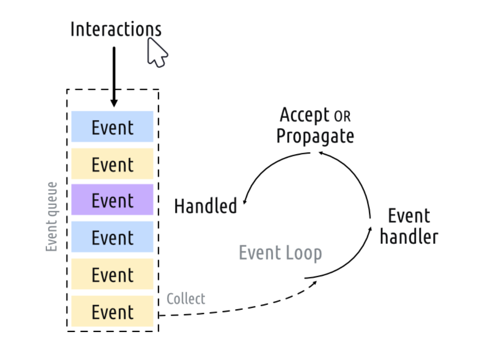

## Creating an application
    from PyQt6.QtWidgets import QApplication, QWidget
    import sys  # 用于访问系统命令变量
    app = QApplication(sys.argv) # 命令变量传递给Qapp，也可传递空列表
    window = QWidget()  # 创造一个可以显示的部件
    window.show()  # 重要！！！ 窗口默认隐藏
    app.exec() # 开始事件循环
    # 除非你停止事件否则代码不会访问这里！  
## stepping through the code
    app = QApplication(sys.argv)
    # 创造一个QApplication的实例，将sys.arg(包含命令行变量的列表)传递给他，如果你不用命令行来控制Qt,你也可以传递空列表
    app = QApplication([])
    # 然后我们用变量名window创建了一个QWidget实例
    window = QWidget()
    # 在QT中所有的顶级窗口部件都是窗口(windows)，也就是说没有父部件，也不用嵌套在一个框架中，你可以用你喜欢的部件创建窗口。
    window.show()
> 没有父部件的部件隐含的默认为不可见，所以你需要调用.show()来显示它，没有窗口你就无法退出程序！
## what's the event loop(事件循环)?
每个Qt Applications的核心是QApplication类，每个application需要唯一一个QApplication对象去实现功能。这个对象保存应用程序的的事件循环——管理所有用户与GUI交互的核心循环。

用户的每一个交互如鼠标点击，将会生成一个放入时间队列的事件，事件循环教会一直监听事件队列，当发现有事件时，将会把这个事件发给特定的事件处理器，待处理完成后又会将控制权转交给事件循环监听下一个事件，在一个应用中只有一个运行着的事件循环。
## QMainWindow
在Qt中，所有部件都可以成为窗口，例如如果你将QtWidegt替换成QPushButton，你会得到一个带有一个可按的按钮窗口。

    import sys
    from PyQt6.QtWidgets import QApplication, QPushButton
    app = QApplication(sys.argv)
    window = QPushButton("Push Me")
    window.show()
    app.exec()
QMainWindow：这是一个预先做好的部件，可以提供一系列的你可能会用到的标准窗口功能，包括工具栏、菜单、状态栏、可停靠的小部件等。现在我们将会添加一个简单的空白QMainWindow在我们的应用程序上。

    import sys
    from PyQt6.QtWidgets import QApplication, QMainWindow
    
    app = QApplication(sys.argv)
    
    window = QMainWindow()
    window.show()
    
    app.exec()     # Start the event loop.
>  运行！ 你会发现他看起来和以前的没什么不同

**创建一个自定义窗口**，最好的方法是创建QMainWindow的子类，然后再__init__里包含窗口的设置。这将允许我们的窗口时自包含的(self contained).我们可以添加自己的QMainWindow子类，命名为MainWindow。
    
    import sys

    from PyQt6.QtCore import QSize, Qt
    from PyQt6.QtWidgets import QApplication, QMainWindow, QPushButton

    # 用QMainWindow的子类来自定义你应用的窗口
    class MainWindow(QMainWindow):
        def __init__(self):
            super().__init__() # 必须有，继承父类的构造方法

            self.setWindowTitle("My App")
            button = QPushButton("Press Me!")

            # 设置窗口的中心部件
            self.setCentralWidget(button)

    app = QApplication(sys.argv)

    window = MainWindow()
    window.show()

    app.exec()

## Szing windows and widgets

     from PyQt6.QtCore import QSize, Qt
     from PyQt6.QtWidgets import QMainWindow

     <MainWindow>.setFixedSize(QSize(400, 300)) # 设置窗口的固定大小
     不包含这个参数的话窗口可以拖拉边缘自定义窗口大小
     <MainWindow>.setMinimumSize(QSize(400, 300)) # 设置最小大小
     <MainWindow>.setMaximumSize(QSize(400, 300)) # 设置最大大小