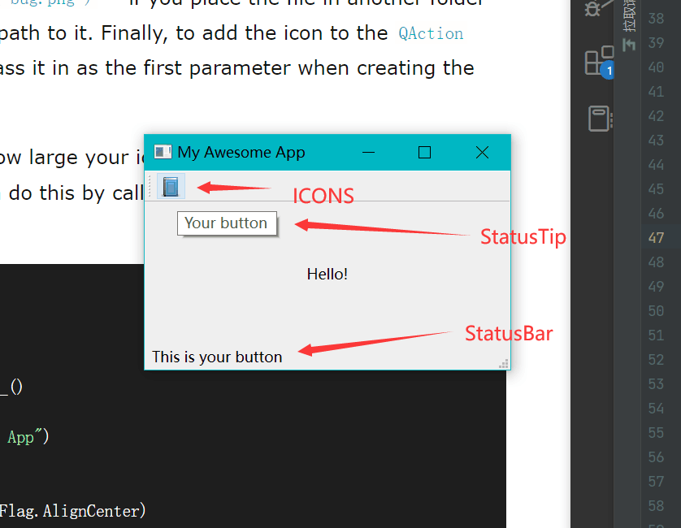
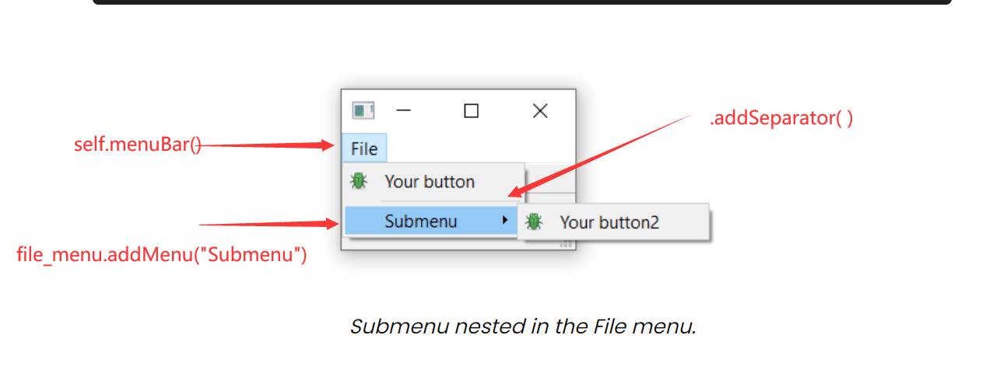

<h1 align = 'center'> Toolbars & Menus </h1>

## Toolbars

### 创建菜单栏：

    toolbar = QToolBar("My main toolbar")
    self.addToolBar(toolbar)

QAction: 一个提供描述抽象用户界面的方法的类，可以在一个对象中定义多个交互接口；每个对象都有可以连接的命名，状态信息，icon，signals等

    button_action = QAction("Your button", self)
    button_action.setStatusTip("This is your button")
    button_action.triggered.connect(self.onMyToolBarButtonClick)
    button_action.setCheckable(True)  # 让按键点击一次开启，再点击关闭，要不然点击按钮后只传出false信号，
    toolbar.addAction(button_action)

### 创建底部状态栏

    self.setStatusBar(QStatusBar(self))  # 创建底部信息栏

### 添加icon

    toolbar.setIconSize(QSize(16,16))
    button_action = QAction(QIcon(r'icons/book.png'),"Your button", self) # 创建实例并添加icon

### 风格  

展现出来的图片或icon，按钮的风格取决于系统默认，你可以通过设置来覆盖它。(.setToolButtonStyle())

| PyQt6 flag (long name)      |       Behavior       |
| :-------------------------- | :------------------: |
| Qt.ToolButtonIconOnly       | 只显示icon不显示文本 |
| Qt.ToolButtonTextOnly       | 只显示文本不显示icon |
| Qt.ToolButtonTextBesideIcon |    文本在icon旁边    |
| Qt.ToolButtonTextUnderIcon  |    文本在图标下面    |
| Qt.ToolButtonFollowStyle    |     跟随桌面风格     |

## Menus

### 创建顶部菜单

    menu = self.menuBar()  # 创建顶部菜单
    file_menu = menu.addMenu("&File")  # 添加一个菜单，传入菜单的名称
    # & 定义了按下ALT时跳转到这个菜单
    file_menu.addAction(button_action) # 添加一个功能

### 添加分割线

    file_menu.addSeparator()  # 添加分割线

### 添加子菜单

    file_submenu = file_menu.addMenu("Submenu")  # 创建子菜单并命名
    file_submenu.addAction(button_action2)  # 子菜单中添加功能
    你只需要在父菜单.addMenu() 就可以添加子菜单

### 添加快捷键

快捷键与QAction连接，与是否添加到菜单无关。

    button_action.setShortcut(QKeySequence("Ctrl+p"))
    toolbar.addAction(button_action)
    # 你可以输入键名来创建快捷键 (e.g. Ctrl+p)
    # Qt.namespace 中的命名  (e.g. Qt.CTRL + Qt.Key_P)
    # or system agnostic identifiers (e.g. QKeySequence.Print)

