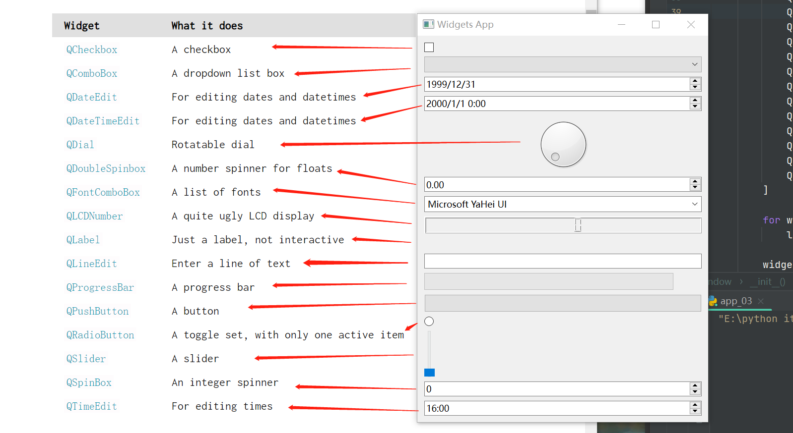
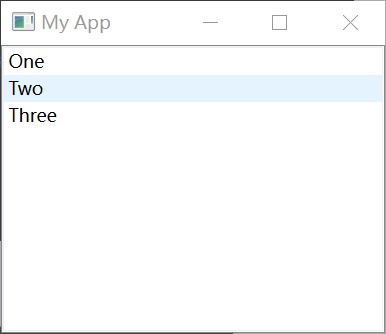
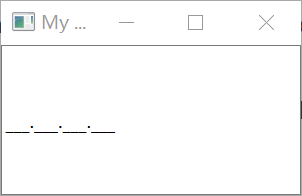

<h1 align = 'center'>Widgets </h1>

## A quick demo

一些小例子

## QLabel

### 展示文本  

    widget = QLabel("1") # 创建QLabel并显示1
    widget..setText("2") # 更改为显示2
    -----------------
    widget = QLabel("Hello")
    font = widget.font()  # 选定字体模块
    font.setPointSize(30)  # 更改字体大小
    widget.setFont(font)  # 应用字体
    widget.setAlignment(Qt.AlignmentFlag.AlignHCenter | Qt.AlignmentFlag.AlignVCenter)
    # 设置对齐样式（垂直居中水平居中）

PyQt6.QtCore.Qt命名空间中有能控制对齐的属性

水平对齐：  

| PyQt6 flag (long name)        |   Behavior   |
| :---------------------------- | :----------: |
| Qt.AlignmentFlag.AlignLeft    |    左对齐    |
| Qt.AlignmentFlag.AlignRight   |    右对齐    |
| Qt.AlignmentFlag.AlignHCenter | 水平居中对齐 |
| Qt.AlignmentFlag.AlignJustify |   自动调整   |

垂直对齐:  

| PyQt6 flag (long name)        |   Behavior   |
| :---------------------------- | :----------: |
| Qt.AlignmentFlag.AlignTop     |   顶部对齐   |
| Qt.AlignmentFlag.AlignBottom  |   底部对齐   |
| Qt.AlignmentFlag.AlignVCenter | 垂直居中对齐 |

> 注意：你只能使用 | 连接垂直与水平对齐而不能用 &

|          PyQt6 Flag          |     Behavior     |
| :--------------------------: | :--------------: |
| Qt.AlignmentFlag.AlignCenter | 水平垂直同时居中 |

### 展示图片  

    widget.setPixmap(QPixmap(path))  #  展示图片
    widget.setScaledContents(True)   #  取消图片等比例放大并填充整个标签

## QCheckBox

        widget = QCheckBox('this is a checkbox')
        widget.setCheckState(Qt.CheckState.Checked)  # 设置初始状态，打勾

        # 如果想要使box有三种状态：widget.setCheckState(Qt.PartiallyChecked)
        # 或者 widget.setTriState(True)
        widget.stateChanged.connect(self.show_state)

        self.setCentralWidget(widget)

    def show_state(self, s):
        print(s == Qt.CheckState.Checked)
        print(s)  # s: 打勾时值为2， 空时值为0

> 你可以使用 state == Qt.Checked 来设置打勾状态.
> Qt.unchecked, Qt.partiallyChecked == state

通过.setChecked 或者 .setCheckState() ，接收True,False,来设置checkbox的初始状态。  
通过Qt命名空间设置状态：

| PyQt6 flag (long name)         | Behavior |
| :----------------------------- | :------: |
| Qt.CheckState.Unchecked        | 没有选中 |
| Qt.CheckState.PartiallyChecked | 部分选中 |
| Qt.CheckState.Checked          | 已经选中 |

> Qt.CheckState.PartiallyChecked:部分选中，此时方框为灰色，并且该框会成为三个状态。

## QComboBox

        widget = QComboBox()
        widget.addItems(["One", "Two", "Three"])  # 下拉菜单添加元素

        widget.currentIndexChanged.connect(self.index_changed)  # 当选择不同项时传出选择项的索引

        widget.currentTextChanged.connect(self.text_changed)  # 当选择不同项时传出选择项的内容

        self.setCentralWidget(widget)

    def index_changed(self, i):  # i: int
        print(i)

    def text_changed(self, s):   # s: str
        print(s)

> widget.setEditable(True)
> 你可以这样设置让combobox可以被修改，具体修改政策如下表：

| PyQt6 flag (long name)                      | Behavior             |
| :------------------------------------------ | :------------------- |
| QComboBox.InsertPolicy.NoInsert             | 不能插入             |
| QComboBox.InsertPolicy.InsertAtTop          | 作为第一个插入       |
| QComboBox.InsertPolicy.InsertAtCurrent      | 替代当前选择的插入   |
| QComboBox.InsertPolicy.InsertAtBottom       | 在最后一个后面插入   |
| QComboBox.InsertPolicy.InsertAfterCurrent   | 在当前选择的后面插入 |
| QComboBox.InsertPolicy.InsertBeforeCurrent  | 在当前选择的前面插入 |
| QComboBox.InsertPolicy.InsertAlphabetically | 按字母顺序插入       |

> widget.setInsertPolicy(QComboBox.InsertPolicy.InsertAlphabetically)
> 这样设置插入政策

> widget.setMaxCount(10)  #  你也可以设置数目的最大值

[阅读QComboBox官方文档了解更多修改的知识](https://www.pythonguis.com/docs/qcombobox/)

## QListWidget

与QComboBox类似

        widget = QListWidget()
        widget.addItems(["One", "Two", "Three"])

        widget.currentItemChanged.connect(self.index_changed)
        widget.currentTextChanged.connect(self.text_changed)

        self.setCentralWidget(widget)

    def index_changed(self, i): # i 是 QListItem对象
        print(i.text())

    def text_changed(self, s): # s is a str
        print(s)

## QLineEdit

单行的文本输入框

        widget = QLineEdit()
        widget.setMaxLength(10)  # 设置文本最大长度
        widget.setPlaceholderText("Enter your text")  # 文本框默认显示的灰色文字

        # widget.setReadOnly(True)  # 设置为只读

        widget.returnPressed.connect(self.return_pressed)
        widget.selectionChanged.connect(self.selection_changed)
        widget.textChanged.connect(self.text_changed)
        widget.textEdited.connect(self.text_edited)

        self.setCentralWidget(widget)

    def return_pressed(self):  # 按回车键触发
        print("Return pressed!")
        self.centralWidget().setText("BOOM!")  # 将输入框内的文本前面加上前缀

    def selection_changed(self):  # 鼠标划动取词触发
        print("Selection changed")
        print(self.centralWidget().selectedText())

    def text_changed(self, s):  # 文本更改后触发，每次更改一个字母都会触发
        print("Text changed...")
        print(s)

    def text_edited(self, s):  # 文本编辑后触发
        print("Text edited...")
        print(s)

> 你可以设置文本的输入格式通过.setInputMask(text)函数
> 例如：widget.setInputMask('000.000.000.000;_')

效果如图:

## QSpinBox and QDoubleSpinBox

QSpinBox: 支持int的数字选择框
QDoubleSpinBox: 支持float的数字选择框

        widget = QSpinBox()
            # Or: widget = QDoubleSpinBox()

        widget.setMinimum(-10)  # 设置数字的边界
        widget.setMaximum(3)
            # Or: widget.setRange(-10,3)

        widget.setPrefix("$")  # 设置前缀
        widget.setSuffix("c")  # 设置后缀
        widget.setSingleStep(3)  # 每按一次箭头数值变化的大小，spinbox只能是整数
        widget.valueChanged.connect(self.value_changed)
        widget.textChanged.connect(self.value_changed_str)

        self.setCentralWidget(widget)

    def value_changed(self, i):  # i 包括前后缀
        print("valueChanged")
        print(i)

    def value_changed_str(self, s): # s不包括前后缀，为int(float)
        print("text changed")
        print(s)

## QSlider

        widget = QSlider()

        widget.setMinimum(-10)
        widget.setMaximum(30)
            # Or: widget.setRange(-10,3)

        widget.setSingleStep(5)  # 这行好像没作用。。。

        widget.valueChanged.connect(self.value_changed)
        widget.sliderMoved.connect(self.slider_position)
        widget.sliderPressed.connect(self.slider_pressed)
        widget.sliderReleased.connect(self.slider_released)

        self.setCentralWidget(widget)

    def value_changed(self, i):  # 数值改变时触发，返回数值
        print(i)

    def slider_position(self, p): # 返回滑块的位置，p为数值
        print("position", p)

    def slider_pressed(self):  # 鼠标点击时触发
        print("Pressed!")

    def slider_released(self): # 鼠标松开时触发
        print("Released")

> 你也可以更改滑动的方向为水平或垂直：
> widget = QSlider(Qt.Orientation.Vertical)  # 垂直
> widget = QSlider(Qt.Orientation.Horizontal) # 水平

## QDial

        widget = QDial()
        widget.setRange(-10, 100)
        widget.setSingleStep(1)

        widget.valueChanged.connect(self.value_changed)
        widget.sliderMoved.connect(self.slider_position)
        widget.sliderPressed.connect(self.slider_pressed)
        widget.sliderReleased.connect(self.slider_released)

        self.setCentralWidget(widget)

    def value_changed(self, i):
        print(i)

    def slider_position(self, p):
        print("position", p)

    def slider_pressed(self):
        print("Pressed!")

    def slider_released(self):
        print("Released")
